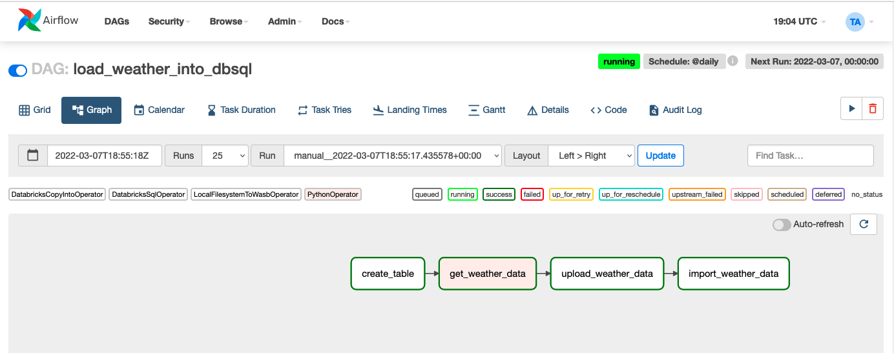

# Airflow DAGs

This directory contains examples of Airflow DAGs that use [apache-airflow-providers-databricks](https://airflow.apache.org/docs/apache-airflow-providers-databricks/stable/index.html).

## Loading weather data into Databricks SQL Endpoint

[load_weather_data_into_dbsql.py](load_weather_data_into_dbsql.py) is an example of the Airflow DAG that loads weather data for some cities into a Delta table using Databricks SQL Endpoint.  DAG consists of following steps:

* `create_table` - creates a Delta table if it doesn't exist using `DatabricksSqlOperator`
* `get_weather_data` - fetch weather data using calls to REST API and saves data to a local disk using `PythonOperator`
* `upload_weather_data` - uploads data from local disk to Azure Blob Storage using `LocalFilesystemToWasbOperator`
* `import_weather_data` - imports uploaded data with `COPY INTO` SQL command executed via `DatabricksCopyIntoOperator`.

To make it working in your environment you need to change following constants:

* `WASBS_CONN_ID` - name of a [Azure Blob Storage connection](https://airflow.apache.org/docs/apache-airflow-providers-microsoft-azure/stable/connections/wasb.html).
* `DATABRICKS_SQL_ENDPOINT_NAME` - name of a [Databricks SQL endpoint](https://docs.databricks.com/sql/admin/sql-endpoints.html) that will be used for creation of the table and importing of data.
* `DATABRICKS_CONN_ID` - name of a [Databricks connection](https://airflow.apache.org/docs/apache-airflow-providers-databricks/stable/connections/databricks.html) that will be used for authentication to Databricks workspace.
* `DESTINATION_TABLE_NAME` - name of Delta table that will be created & loaded with data.
* `LANDING_LOCATION_PREFIX` - name of directory inside the ADLS container. 
* `ADLS_CONTAINER_NAME` - name of ADLS container.
* `ADLS_STORAGE_NAME` - name of ADLS storage account (without `.dfs.core.windows.net`).

